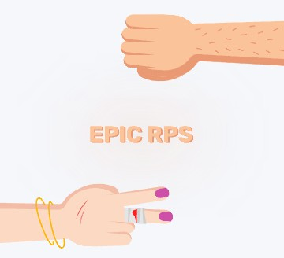

<div align="center">
      <h1> <br/>Stone Paper Scissors</h1>
</div>

# Live Preview

[Demo](https://stone-papers-scissors.netlify.app/)

# Stone Paper Scissors

"Stone Paper Scissors" game built with React.js and framer motion and it is a PWA

# Tech which I have Used


## Follow the below instruction to run this project in your pc.👇

```
git clone https://github.com/Milan-960/Stone-paper-scissors.git
```

```
npm install
```

```
npm
```
